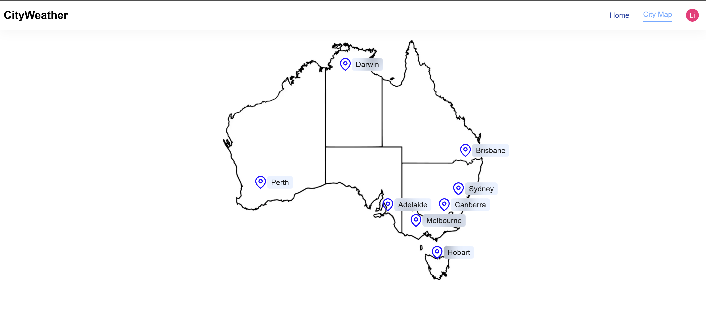
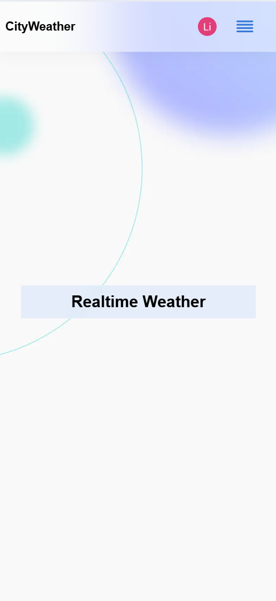

# cityweather# City Weather Platform

[](https://nextjs.org/)
[](https://www.typescriptlang.org/)
[](https://clerk.com/)

## Preview

### Web
<p align="center">
  
</p>

### Mobile
<p align="center">
  
</p>

## 🚀 Quick Start

### Prerequisites
- Docker

### Installation

1. **Clone repository**
```bash
git clone https://github.com/Jingli-123/cityweather.git
cd cityweather
```

2. **Environment Setup**
Create `.env` files in /backend: `.env` and `.env.local` in the /frontend directory.

Edit `.env.local` with your credentials:
```env
# Clerk Authentication
NEXT_PUBLIC_CLERK_PUBLISHABLE_KEY=pk_test_ZGVzaXJlZC1zbHVnLTQ5LmNsZXJrLmFjY291bnRzLmRldiQ
CLERK_SECRET_KEY=sk_test_nD49RceX3ZpLB6XLkX8vDqQ8J8JccCSXPqZSAYJM04
NEXT_PUBLIC_API_URL=http://localhost:3001
```


Edit `.env` with your credentials:
```env
# Clerk Authentication
CLERK_SECRET_KEY=sk_test_nD49RceX3ZpLB6XLkX8vDqQ8J8JccCSXPqZSAYJM04
FRONTEND_URL=http://localhost:3000
PORT=3001
```
3. **Install application with docker**

in the project root directory
```bash
docker compose up
````

4. **Install application without docker**

in the project root directory
```bash
cd frontend
npm install
npm run dev
````

in the project root directory
```bash
cd backend
npm install
npm run dev
````

5. **Start the application for dev environment**
http://localhost:3000


